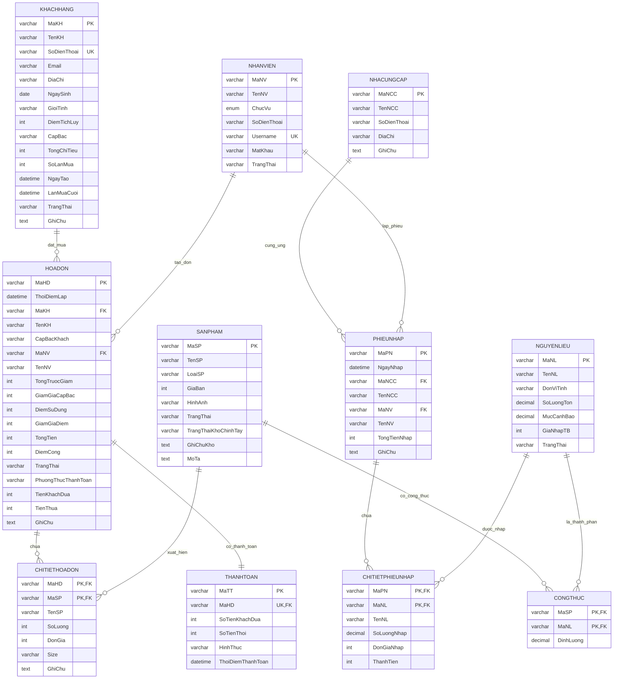

# Sơ đồ ER

```mermaid
erDiagram
    NHANVIEN {
        varchar MaNV PK
        varchar TenNV
        enum ChucVu
        varchar SoDienThoai
        varchar Username UK
        varchar MatKhau
        varchar TrangThai
    }

    KHACHHANG {
        varchar MaKH PK
        varchar TenKH
        varchar SoDienThoai UK
        varchar Email
        varchar DiaChi
        date NgaySinh
        varchar GioiTinh
        int DiemTichLuy
        varchar CapBac
        int TongChiTieu
        int SoLanMua
        datetime NgayTao
        datetime LanMuaCuoi
        varchar TrangThai
        text GhiChu
    }

    NHACUNGCAP {
        varchar MaNCC PK
        varchar TenNCC
        varchar SoDienThoai
        varchar DiaChi
        text GhiChu
    }

    NGUYENLIEU {
        varchar MaNL PK
        varchar TenNL
        varchar DonViTinh
        decimal SoLuongTon
        decimal MucCanhBao
        int GiaNhapTB
        varchar TrangThai
    }

    SANPHAM {
        varchar MaSP PK
        varchar TenSP
        varchar LoaiSP
        int GiaBan
        varchar HinhAnh
        varchar TrangThai
        varchar TrangThaiKhoChinhTay
        text GhiChuKho
        text MoTa
    }

    CONGTHUC {
        varchar MaSP PK,FK
        varchar MaNL PK,FK
        decimal DinhLuong
    }

    HOADON {
        varchar MaHD PK
        datetime ThoiDiemLap
        varchar MaKH FK
        varchar TenKH
        varchar CapBacKhach
        varchar MaNV FK
        varchar TenNV
        int TongTruocGiam
        int GiamGiaCapBac
        int DiemSuDung
        int GiamGiaDiem
        int TongTien
        int DiemCong
        varchar TrangThai
        varchar PhuongThucThanhToan
        int TienKhachDua
        int TienThua
        text GhiChu
    }

    CHITIETHOADON {
        varchar MaHD PK,FK
        varchar MaSP PK,FK
        varchar TenSP
        int SoLuong
        int DonGia
        varchar Size
        text GhiChu
    }

    THANHTOAN {
        varchar MaTT PK
        varchar MaHD UK,FK
        int SoTienKhachDua
        int SoTienThoi
        varchar HinhThuc
        datetime ThoiDiemThanhToan
    }

    PHIEUNHAP {
        varchar MaPN PK
        datetime NgayNhap
        varchar MaNCC FK
        varchar TenNCC
        varchar MaNV FK
        varchar TenNV
        int TongTienNhap
        text GhiChu
    }

    CHITIETPHIEUNHAP {
        varchar MaPN PK,FK
        varchar MaNL PK,FK
        varchar TenNL
        decimal SoLuongNhap
        int DonGiaNhap
        int ThanhTien
    }

    SANPHAM ||--o{ CONGTHUC : co_cong_thuc
    NGUYENLIEU ||--o{ CONGTHUC : la_thanh_phan

    KHACHHANG ||--o{ HOADON : dat_mua
    NHANVIEN ||--o{ HOADON : tao_don

    HOADON ||--o{ CHITIETHOADON : chua
    SANPHAM ||--o{ CHITIETHOADON : xuat_hien

    HOADON ||--|| THANHTOAN : co_thanh_toan

    NHACUNGCAP ||--o{ PHIEUNHAP : cung_ung
    NHANVIEN ||--o{ PHIEUNHAP : lap_phieu

    PHIEUNHAP ||--o{ CHITIETPHIEUNHAP : chua
    NGUYENLIEU ||--o{ CHITIETPHIEUNHAP : duoc_nhap
```