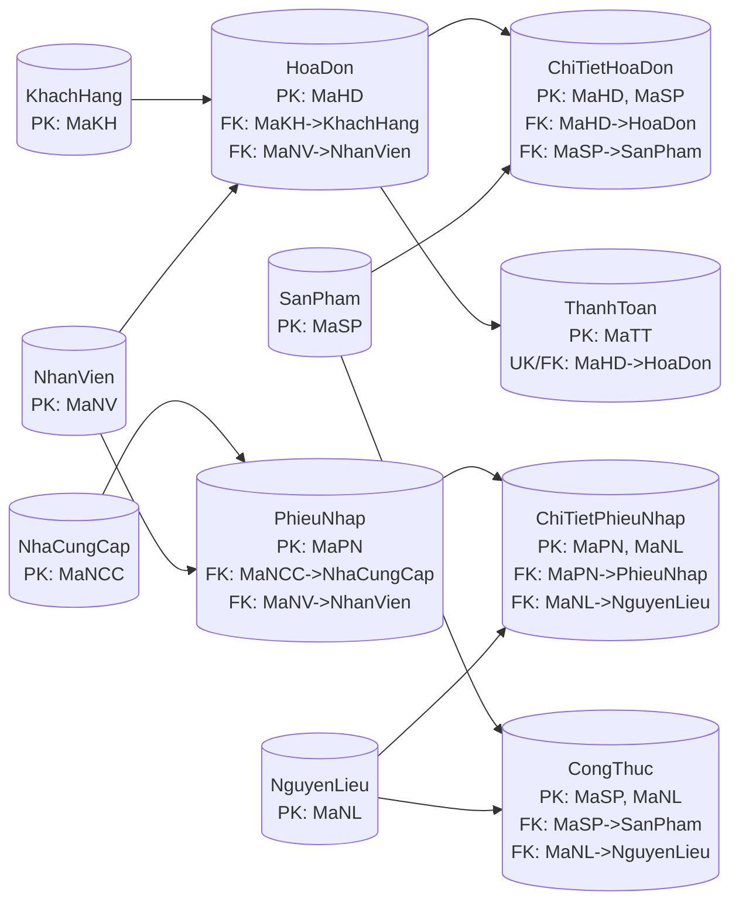

# Sơ đồ RD (nằm ngang)

```mermaid
flowchart LR
    NHANVIEN[(NhanVien\nPK: MaNV)]
    KHACHHANG[(KhachHang\nPK: MaKH)]
    NHACUNGCAP[(NhaCungCap\nPK: MaNCC)]
    NGUYENLIEU[(NguyenLieu\nPK: MaNL)]
    SANPHAM[(SanPham\nPK: MaSP)]

    CONGTHUC[(CongThuc\nPK: MaSP, MaNL\nFK: MaSP->SanPham\nFK: MaNL->NguyenLieu)]

    HOADON[(HoaDon\nPK: MaHD\nFK: MaKH->KhachHang\nFK: MaNV->NhanVien)]
    CTHD[(ChiTietHoaDon\nPK: MaHD, MaSP\nFK: MaHD->HoaDon\nFK: MaSP->SanPham)]
    THANHTOAN[(ThanhToan\nPK: MaTT\nUK/FK: MaHD->HoaDon)]

    PHIEUNHAP[(PhieuNhap\nPK: MaPN\nFK: MaNCC->NhaCungCap\nFK: MaNV->NhanVien)]
    CTPN[(ChiTietPhieuNhap\nPK: MaPN, MaNL\nFK: MaPN->PhieuNhap\nFK: MaNL->NguyenLieu)]

    SANPHAM --> CONGTHUC
    NGUYENLIEU --> CONGTHUC

    KHACHHANG --> HOADON
    NHANVIEN --> HOADON

    HOADON --> CTHD
    SANPHAM --> CTHD
    HOADON --> THANHTOAN

    NHACUNGCAP --> PHIEUNHAP
    NHANVIEN --> PHIEUNHAP

    PHIEUNHAP --> CTPN
    NGUYENLIEU --> CTPN
```